# The structure screen

[ภาษาไทย](structure-screen.th.md)

`/kit/structure` is where you design a project's structure before you build it. It draws the manifests in `.kit/structure/` as a diagram, changes them through forms beside the diagram, and shows on every card how far the code has got. It only designs: it writes JSON and never runs a command. `php artisan kit:apply` builds what you designed.

This guide walks through one design from an empty context to working code, then covers every part of the screen. The rules the screen enforces are in [structure.md](../resources/boost/guidelines/structure.md). This guide links to them rather than restating them.

## Before you start

The screen is registered only when the app runs with `APP_ENV=local`. It has no login and answers to no policy, so it never reaches a deployed app. It needs:

- `App\Providers\KitServiceProvider` in `bootstrap/providers.php`;
- `resources/js/kit/structure.tsx` among the `input` of `laravel()` in `vite.config.ts`;
- Vite: `npm run dev` while you work, or `npm run build`.

`php artisan kit:setup` sets up the first two. Then open `http://your-app.test/kit/structure`. The **?** menu at the top right opens this **Guide**, and **Docs** opens `/kit/docs`, the kit's rules and guides.

On a new project the overview shows a single card, `Shared`, the shared kernel every context may use.

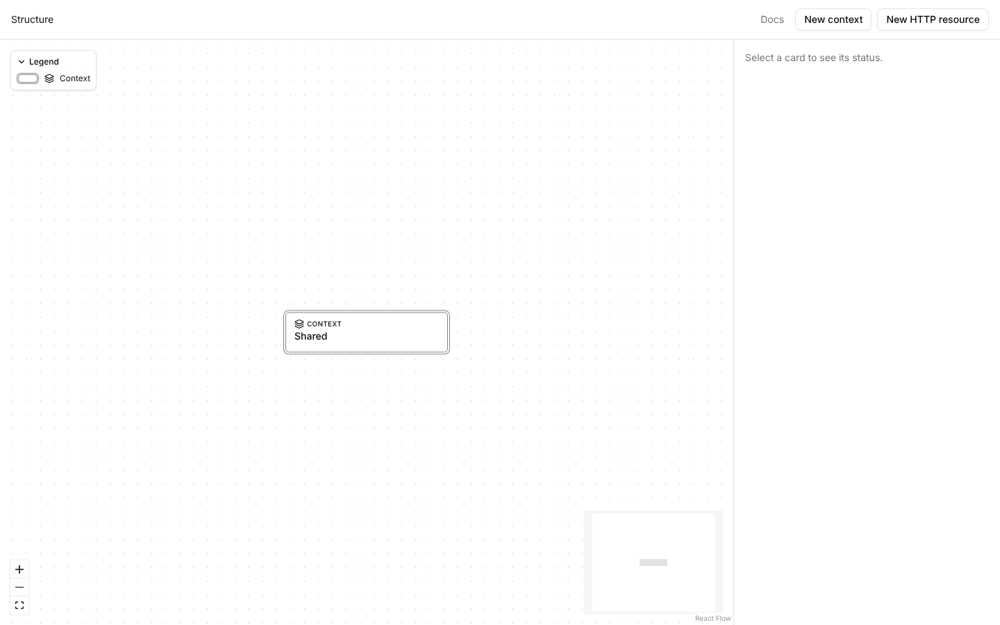

## Walkthrough: from an empty context to working code

The example builds a `Shipping` context with one aggregate, `Crate`, and a page that lists crates.

### 1. Create the context

Choose **New ▸ Context**, type `Shipping` and click **Create**. A context name is StudlyCase, and the kit's own folders (`Shared`, `Audit`, `Auth`, `Concerns`) are taken. The screen opens the new, empty context.

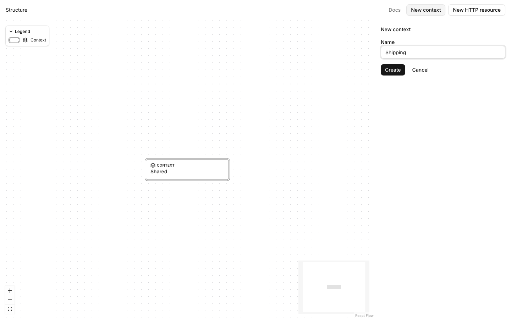

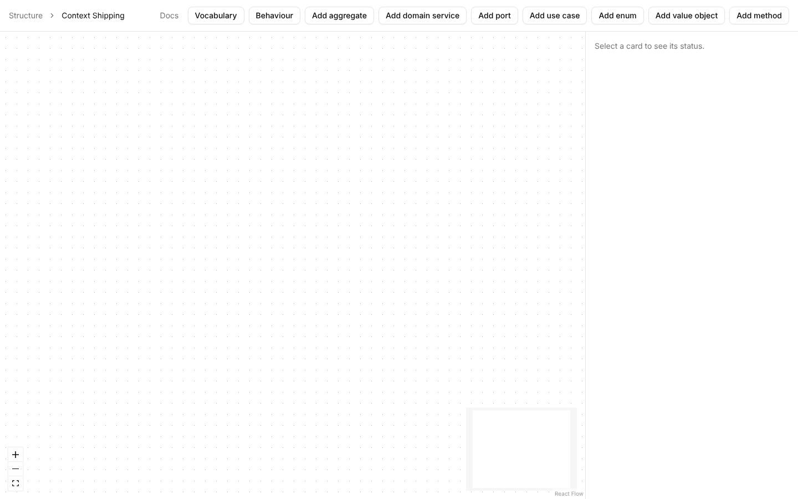

### 2. Add the aggregate

Choose **Add ▸ Aggregate** (the Add menu groups what a context holds: Domain, Vocabulary, Application). Fill in:

- **Name:** `Crate`;
- **Child entities, separated by commas:** `Lid`;
- **Repository:** ticked, so the aggregate is saved through `CrateRepository`.

Click **Add**.

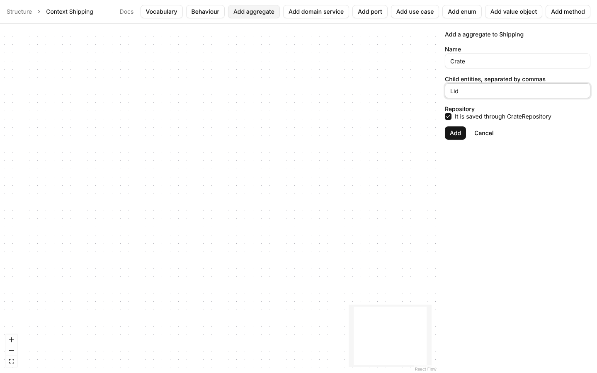

The card appears with the status **ready**. Click it. The side panel shows the exact command `kit:apply` will run for it.

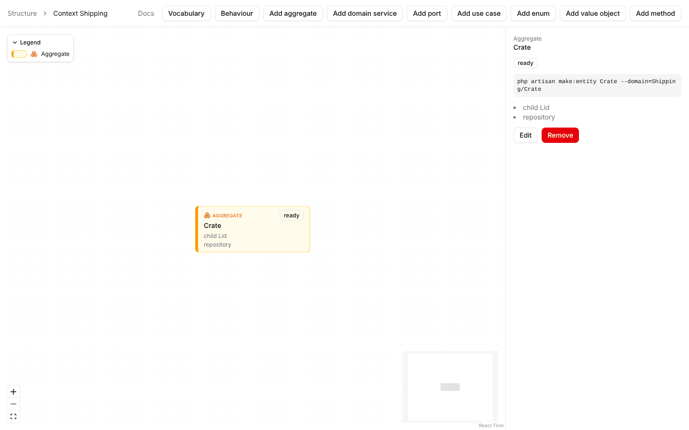

### 3. Add a status

Choose **Add ▸ Enum**:

- **Name:** `CrateStatus`;
- **Aggregate:** `Crate`;
- **Backing:** `string`;
- tick **A status: each case lists the cases it may become**;
- **Cases, in order:** `Open` and `Sealed`, using **Add a case** for the second row. Leave the value empty to get the case name in snake case (`open`, `sealed`).

Under each case, **may become** lists the other cases. Select `Sealed` under `Open`. `Sealed` selects nothing, so it reads **· final**.

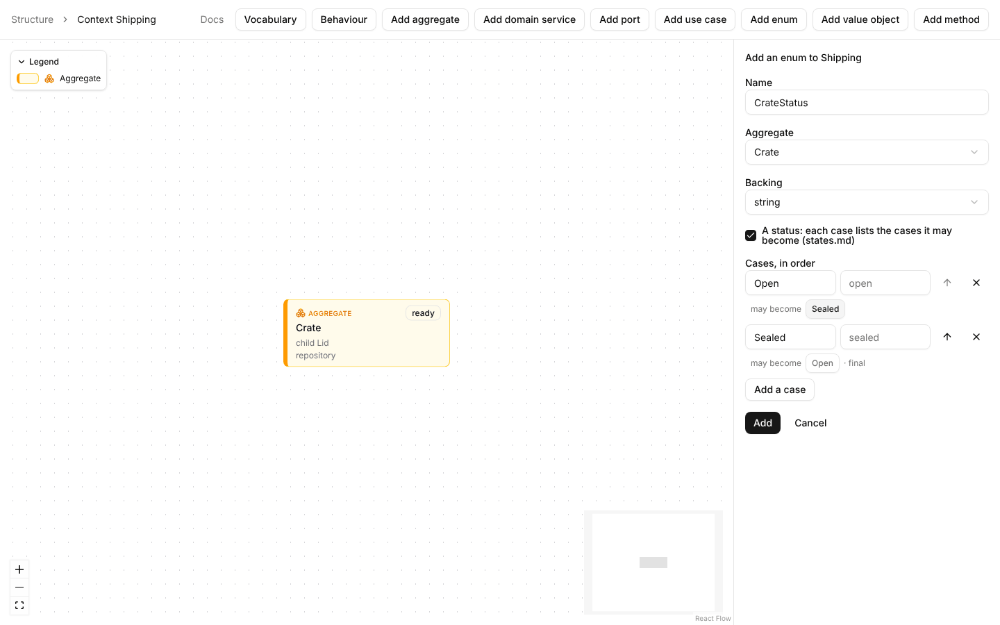

An enum named `*Status` that lists its moves is a status (see [states.md](../resources/boost/guidelines/states.md)).

### 4. Add a value object

Choose **Add ▸ Value object**. Set **Name** to `CrateLabel` and **Aggregate** to `Crate`. Then add two fields in **Fields, in constructor order**: `code` of type `string`, and `note` of type `?string`. The type box suggests builtins and the classes this context designs.

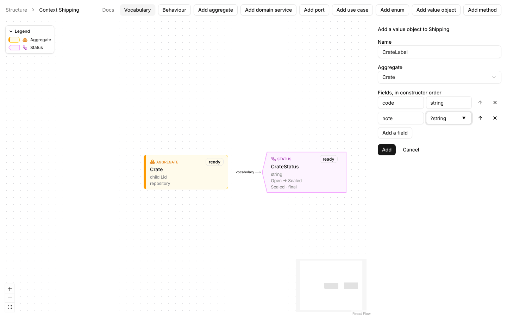

Saving an enum or a value object turns on **Vocabulary**, which draws them beside their aggregate.

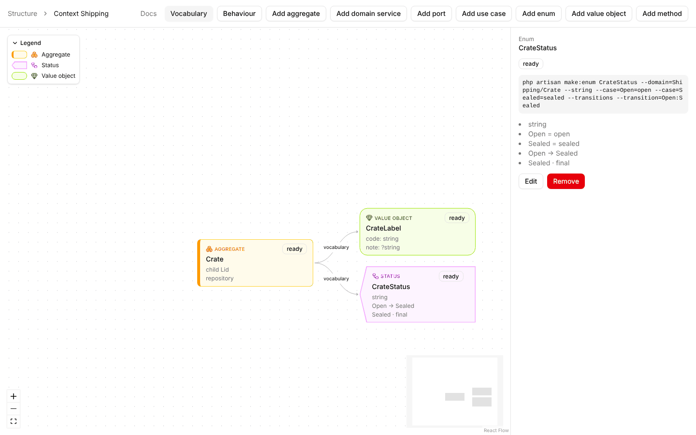

A value object takes methods too. Select its card and press the **+** beside **Methods** in its panel. The form is the entity method's form below. A behaviour of a value object returns a new one (`self`), so `kit:apply` writes it to return a copy built from the fields, for you to change; a name that starts with `assert` is an assertion. The card lists the methods under the fields. Once the value object is built its fields are locked, but it still takes new methods.

### 5. Design the exception

The method you add next refuses with an exception. Design it first: the method then picks it from a list, and `kit:apply` builds it in its home. Choose **Add ▸ Exception**:

- **Name:** `CrateSealedException`;
- **Kind:** `Refusal of an aggregate`;
- **Aggregate:** `Crate`.

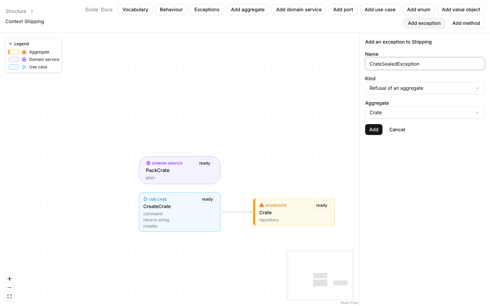

The other kinds follow [exceptions.md](../resources/boost/guidelines/exceptions.md):

- **Invalid value:** a value the FormRequest should have stopped, extending `DomainValueException`, in an aggregate's `Exceptions/`. In the shared kernel it is the only kind.
- **Refusal of a use case:** extending `ApplicationException`, beside the use case it names, or at the root of the context's application when **Use case** is None.

A domain service's own exception is not designed here: tick **It has its own exception** on the service's form instead.

Saving an exception turns on the **Exceptions** switch, which draws each exception tied to the aggregate or the use case it belongs to.

### 6. Add a method to the entity

Choose **Add ▸ Entity method** (or the **+** beside **Methods** in an entity's panel):

- **Entity:** `Crate`;
- **Name:** `seal` (a name that starts with `assert` makes an assertion instead of a behaviour);
- **Parameters, in order:** `label` of type `CrateLabel`;
- **Throws:** `CrateSealedException`. The field offers the exceptions designed for `Crate` by name, and those of the shared kernel and other aggregates with their prefix (`Shared/X`, `Context/Aggregate/X`).

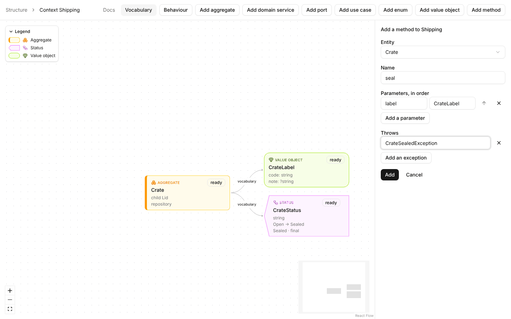

Saving a method turns on **Behaviour**, which draws the entity with its methods.

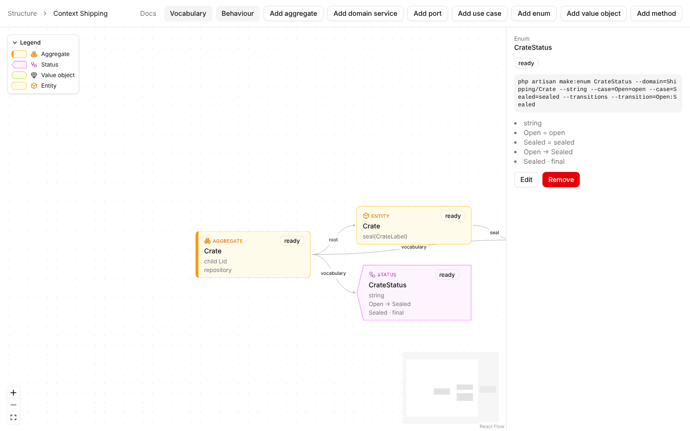

With **Exceptions** on as well, the exception's card is tied to `Crate`, which refuses with it, and to `seal`, which throws it. Its panel lists every method that throws it.

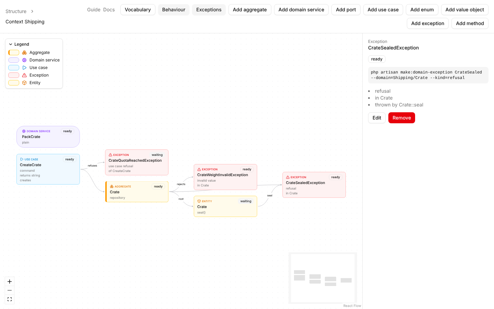

### 6b. Give the entity its state

Select the `Crate` entity card (under **Behaviour**) and click the **+** beside **State**:

- **Name:** `status`;
- **Type:** `CrateStatus`. The field offers builtins, then the enums, value objects and entities of `Crate`, then those elsewhere with their prefix.

Each property lands last, after the ones the entity holds, and the card lists it above the methods (`status: CrateStatus`), tied to the enum it names. `kit:apply` runs `make:entity-state`, which writes:

- a private property the constructor promotes;
- a parameter of `reconstitute()`, passed on to `new self(…)`;
- a getter of the same name, `status(): CrateStatus`.

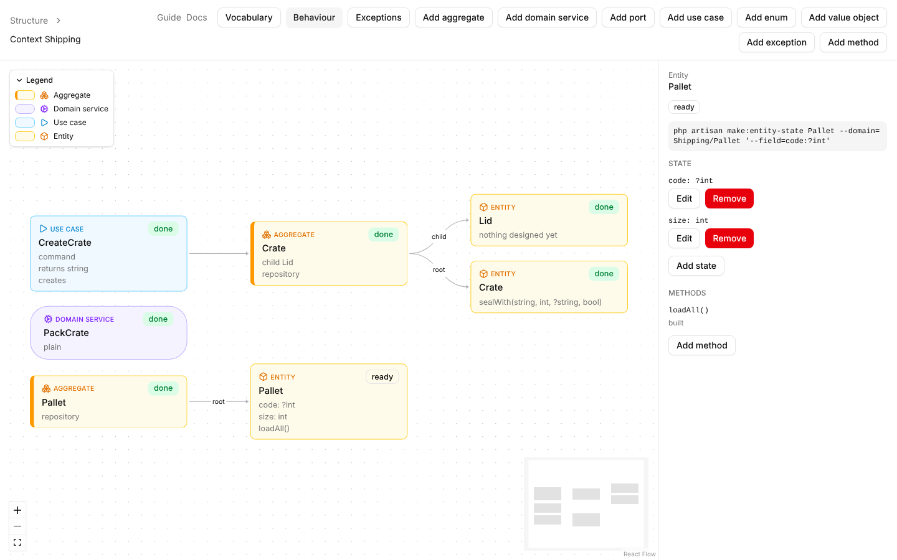

It leaves `create()` for you, because what a new crate starts with (`CrateStatus::Open`) is a rule you decide. It warns you, and PHPStan and the entity's test name the gap until `create()` passes the property. Map the property in the repository's `toModel()` and `toEntity()` too.

### 7. Add the use cases

Choose **Add ▸ Use case** for `CreateCrate`:

- **Shape of __invoke():** `command`;
- **Returns:** `string`, the id it creates;
- **Options:** tick **Mints ids through IdGenerator**;
- **Repositories it injects:** tick `Crate`.

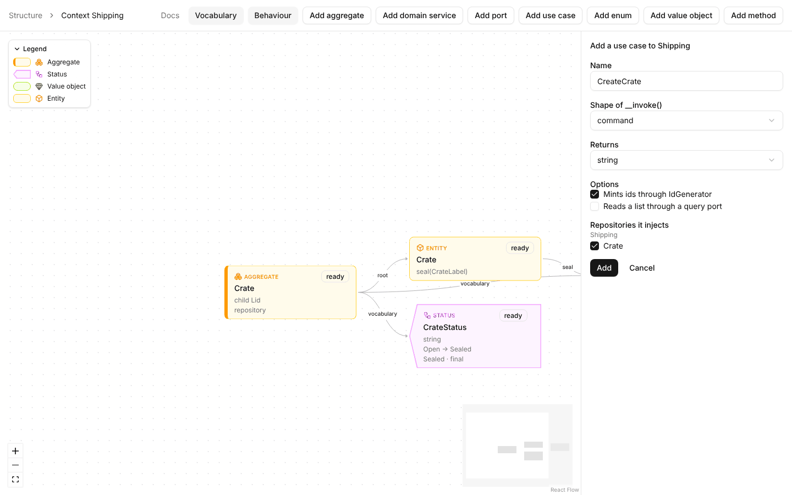

Then add `ListCrates`, the use case the list page reads. Tick **Reads a list through a query port** but leave the shape on `command`. The screen refuses the save and shows the reason under the field it concerns:

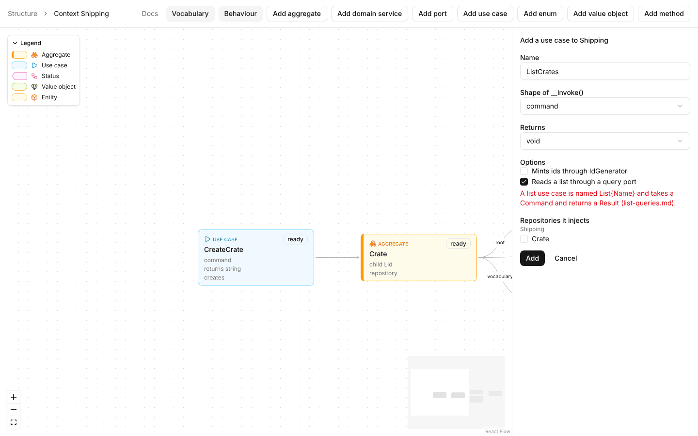

A list use case takes a Command and returns a Result, so set **Shape of __invoke()** to `command-result` (Returns becomes `result`) and click **Add** again. The context now holds the whole design:

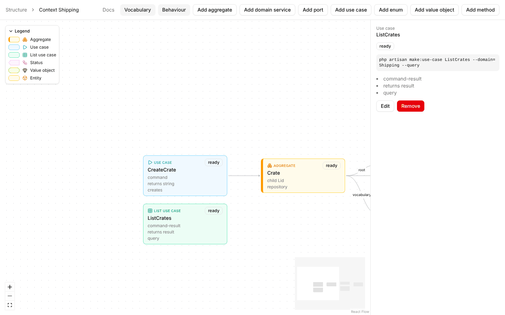

### 8. Create the HTTP resource

Go back to the overview (the **Structure** breadcrumb) and choose **New ▸ HTTP resource**. The name is the controller's name without `Controller`: `Crate`. It stands for the model `Crate`. Tick **It stands for no model** only for a page that has none, like a report.

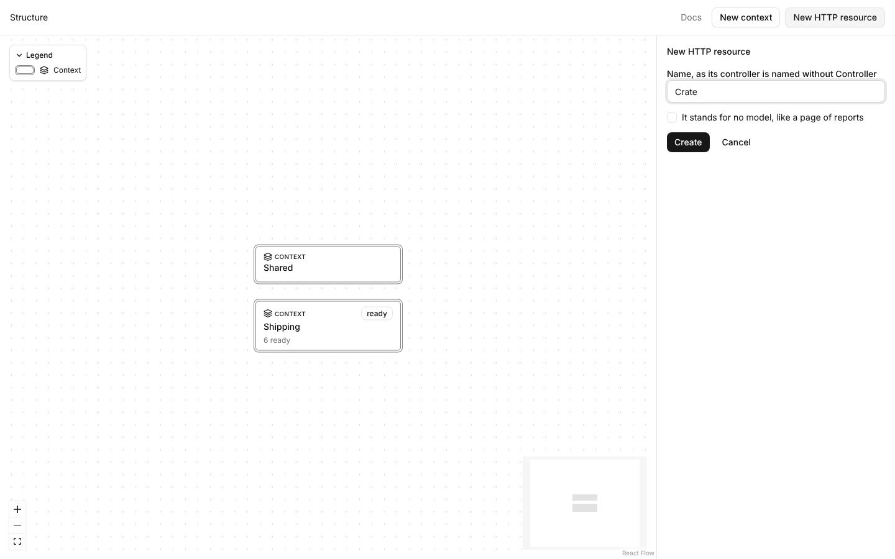

In the resource:

1. **Add ▸ Controller method** `index`. The use cases offered depend on the method's name. `index` offers only the `command-result` ones, so tick `ListCrates`.
2. **Add ▸ Controller method** `store`, calling `CreateCrate`.
3. **Add page** `crates/index`, kind `table`. A list page sits at `{list}/index`, named after the index's `List…` use case.
4. Under **Model and policy** (the gear beside **Add**), untick **No policy** and type the abilities `create, viewAny`.

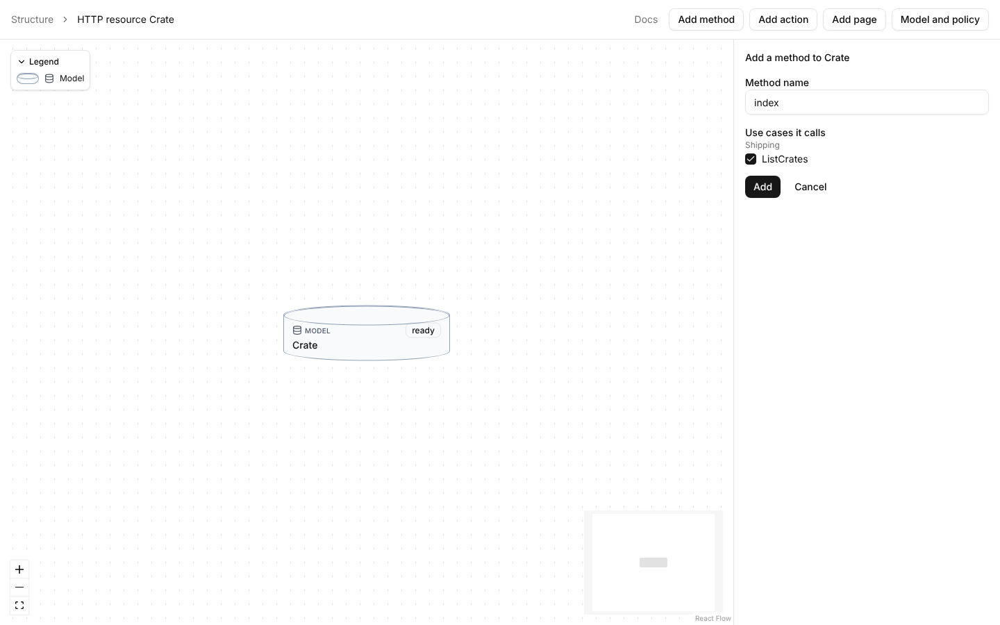

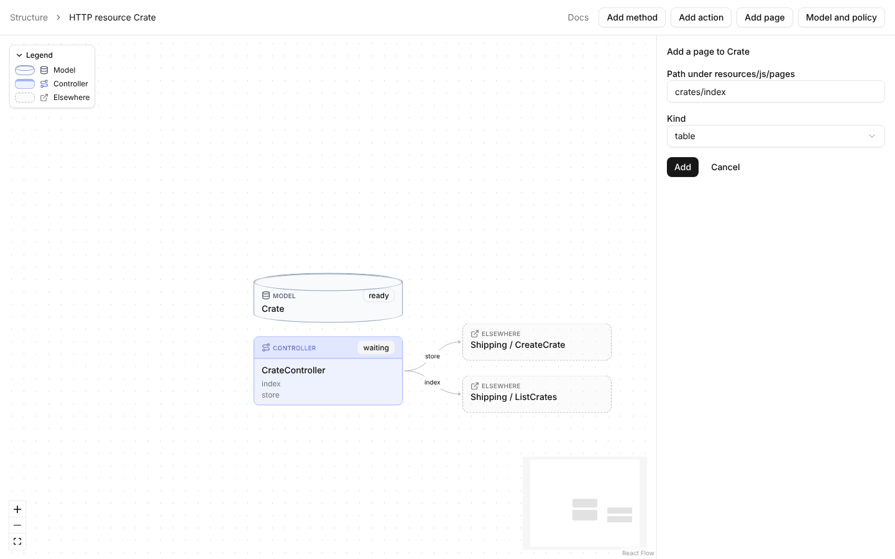

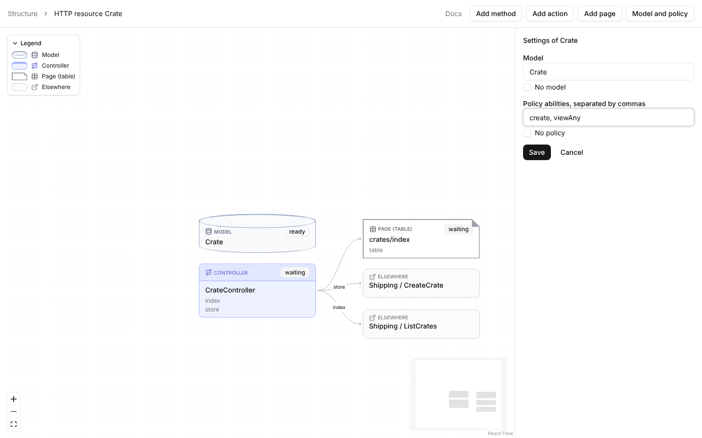

Cards that depend on others wait for them. The page waits for the use case `Shipping/ListCrates`. Cards from another context, such as the use cases the controller calls, are drawn dashed as **Elsewhere**. Double-click one to open its context.

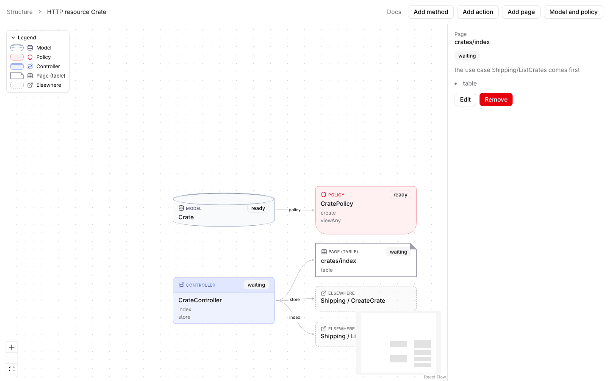

The overview now shows both, with the number of use cases the resource calls:

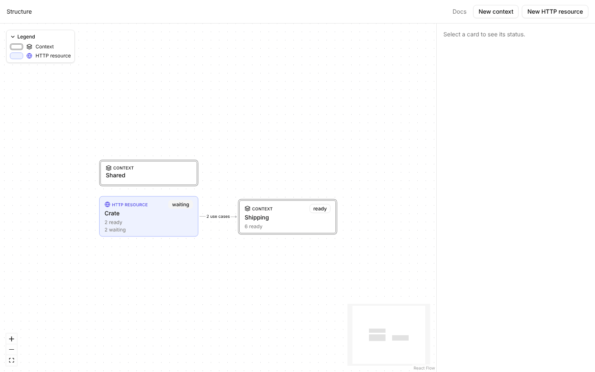

### 9. Plan and build

The screen's statuses are a live `kit:plan`. Run it in a terminal to see the same steps in order:

```
$ php artisan kit:plan
   INFO  Ready to run (8):
  aggregate Shipping/Crate  php artisan make:entity Crate --domain=Shipping/Crate
  enum Shipping/CrateStatus  php artisan make:enum CrateStatus --domain=Shipping/Crate --string --case=Open=open --case=Sealed=sealed --transitions --transition=Open:Sealed
  …
   INFO  Waiting (7):
  child Shipping/Crate/Lid .................. the root CrateEntity comes first
  …
   INFO  Done: 0 of 15 steps.
```

Then build:

```
$ php artisan kit:apply
  …
   INFO  Waiting (1):
  list page crates/index ........ fill in the keys of the ListCrates Row first
   INFO  Done: 13 of 14 steps.
```

`kit:apply` runs every ready step, plans again, and repeats until nothing is ready. It stops at steps that wait for code only a person writes. Reload the screen, which reads the code again: built cards read **done**. A built piece is locked, and its panel offers **Replace** instead of Edit (see [Replacing what is built](#replacing-what-is-built)).

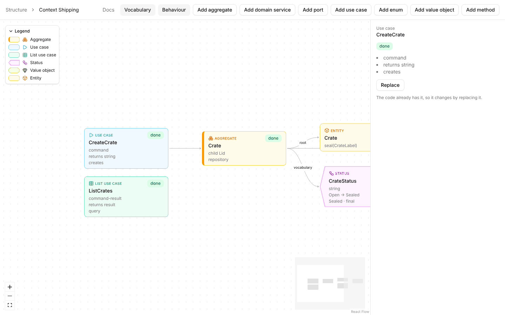

### 10. Finish by hand, then build again

Two cards still need you:

- **differs:** the code is built another way than the manifest says. Here `CratePolicy` exists, but the model does not name it yet. `kit:apply` printed the line to add: `#[UsePolicy(CratePolicy::class)]` on `App\Models\Crate`. Delete the abilities you did not design (`view`, `update`, `delete`) from the generated policy too.

  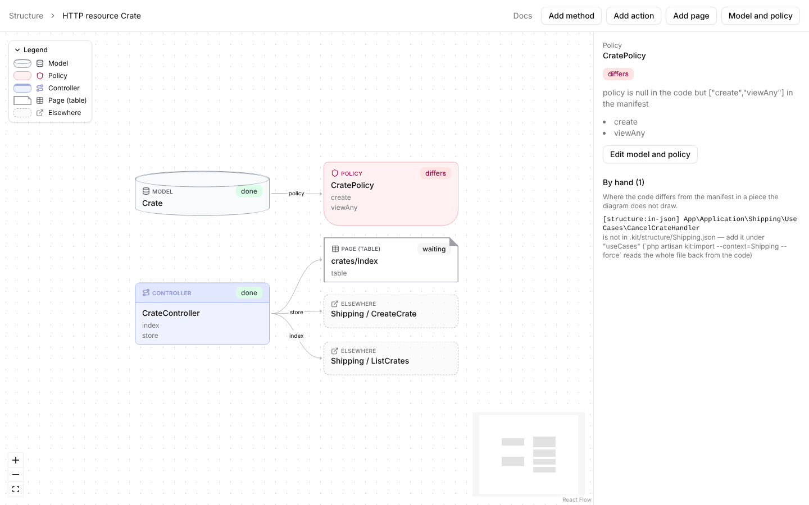

- **waiting:** the reason says what to write first. The list page needs the keys of `CrateListRow::toArray()`, so add the columns the table shows.

  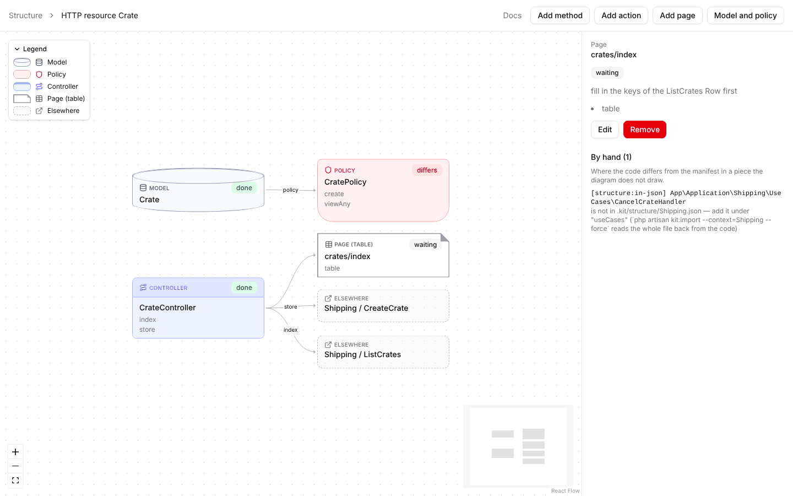

Run `php artisan kit:apply` again. It builds the page. The only thing left is what no generator writes: the `throw` lines in `seal()`. `kit:apply` ends with them, under **By hand**:

```
   WARN  By hand (1), where the code still differs from the manifest:
  [structure:matches] .kit/structure/Shipping.json: entities.Crate.seal.throws is [] in the code but ["CrateSealedException"] in the manifest
```

The side panel has a **By hand** list too, for differences no card shows. A typical one is code no manifest lists. Here, a use case made with `make:use-case` outside the design:

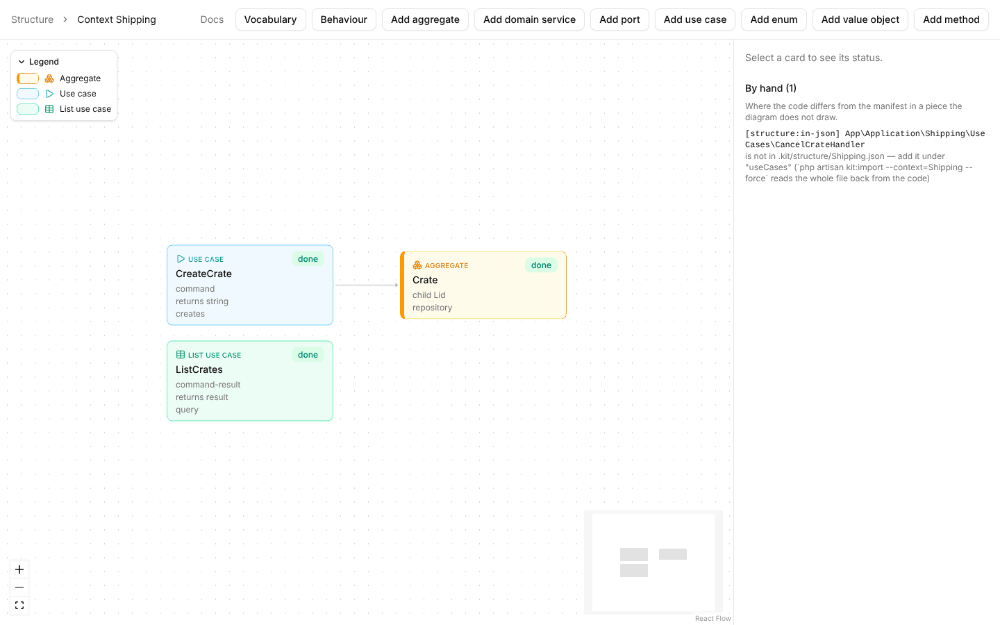

Once the `throw` is written, every card reads **done**:

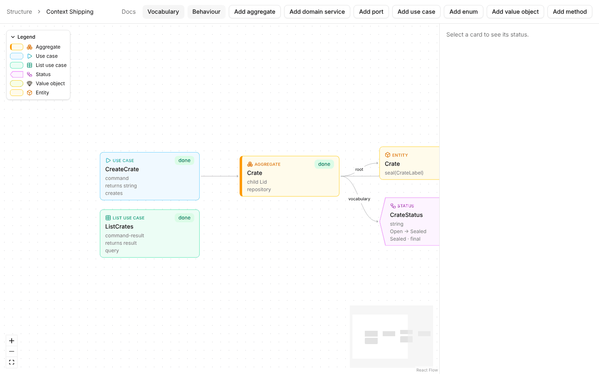

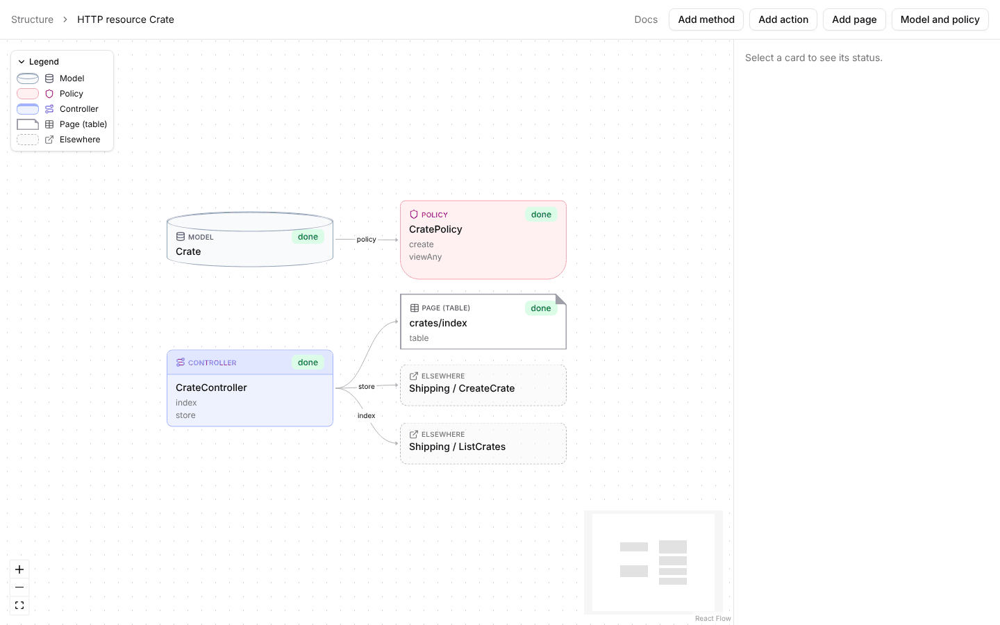

Finish with `php artisan test --testsuite=Architecture`. The `structure` check holds the code and the manifests to each other from now on.

## Reading the screen

### Views

| View | How to open it | What it shows |
|---|---|---|
| Overview | `/kit/structure`, or the **Structure** breadcrumb | One card per context and per HTTP resource, with their status counts. Edges show which context uses which, and how many use cases a resource calls. |
| Context | Double-click a context, or `#context/{Name}` | Its aggregates, domain services, ports and use cases, with the repositories each one injects. **Vocabulary** adds enums and value objects. **Behaviour** adds every root and child entity, with its state and its methods, or `nothing designed yet`. **Exceptions** adds the exceptions. The three are switches in the **View** menu, and the browser remembers them across reloads. |
| Shared kernel | `#context/Shared` | Only the enums, value objects and invalid values every context may use. |
| HTTP resource | Double-click a resource, or `#resource/{Name}` | Its model, policy, controller, actions and pages, and the use cases they call. |

The address bar keeps the view, so a link opens the same view and the browser's back button works. The canvas pans and zooms (the controls are at the bottom left, the minimap at the bottom right), but cards cannot be dragged: the layout is computed.

### Cards

Each kind has its own shape, colour and icon. The **Legend** at the top left names the kinds drawn in the current view, and collapses.

| Kind | Shape | Colour |
|---|---|---|
| Context | double border | plain |
| HTTP resource | box | indigo |
| Aggregate | box with a bar | amber |
| Entity | box | amber |
| Domain service | pill | violet |
| Port | hexagon | teal |
| Use case | box | sky |
| List use case | box | emerald |
| Enum | label tag | fuchsia |
| Status | label tag, with its own icon | fuchsia |
| Value object | soft corners | lime |
| Exception | box, with a warning sign | red |
| Model | cylinder | slate |
| Policy | shield | rose |
| Controller | box with a header | indigo |
| Action | pill | orange |
| Page | folded sheet, icon by kind (table, grid, form, page) | zinc |
| Elsewhere | dashed | grey |

A card lists up to six lines, then `… N more`. A status lists its moves (`Open → Sealed`, `Sealed · final`) in place of its values. An enum lists its cases, a value object its fields then its methods, and an entity its state (`status: CrateStatus`) then its methods.

Click a card to select it. Click empty canvas to clear the selection. Double-click a card that opens something (a context, a resource, or an Elsewhere card) to go there. The panel offers the same as an **Open …** button.

### Statuses

Every card carries the status `kit:plan` gives the steps that build it:

| Status | Means | The panel shows |
|---|---|---|
| **done** | Built. | The piece in full. |
| **ready** | `kit:apply` can build it now. | The exact command. |
| **waiting** | Something comes first: another piece, or code a person writes. | What it waits for. |
| **differs** | Built, but not the way the manifest says. | The check's own message. |

Elsewhere cards carry no status; their own context shows it.

### The side panel

For the selected card the panel shows its kind and name, the status and its reason or command (with a copy button), then its contents as small tables: an enum's cases and moves, a value object's fields and methods, an entity's state and methods, an aggregate's children, a controller's methods, the methods that throw an exception.

What applies to the card sits as icons under its name, each named in a tooltip: **Open** (↗), **Edit** (pencil), **Remove** (bin), **Sync from code** (circling arrows), **Replace**, **Cancel replacement**. A table row carries the same icons for its own row, and a table's **+** adds a row. A built row shows a green tick instead; hover it for what is built (a property's getter, for one).

A change applies where you stand: the cards keep their places, the selected card stays selected with its panel open, and a short message at the bottom says what happened. A card a form from the **Add** menu adds is selected and brought into view.

At the bottom, **By hand (N)** lists every difference between the code and the manifests that has no card. A typical one is a class the code holds that no manifest lists. It names the check, the subject and what to do, often `php artisan kit:import --context=X --force`.

## Changing the design

The header's menus offer the forms of the current view:

- **Overview:** **New ▸** Context, HTTP resource.
- **Context:** **Add ▸** Domain (Aggregate, Entity method, Exception), Vocabulary (Enum, Value object), Application (Use case, Domain service, Port); **View ▸** the Vocabulary, Behaviour and Exceptions switches.
- **Shared kernel:** **Add ▸** Enum, Value object, Invalid value.
- **HTTP resource:** **Add ▸** Controller method, Action, Page; the gear opens Model and policy.
- **Every view:** **?** opens the Guide and the Docs.

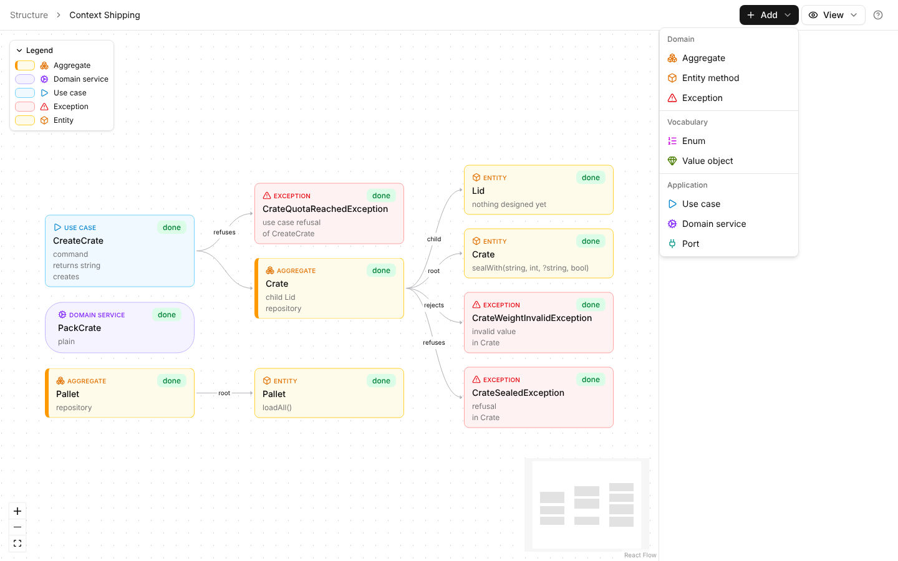

**Add** saves at once, in canonical form, and redraws the diagram. **Cancel** closes the form and writes nothing. When the server refuses, each reason appears under the field it concerns and nothing is written.

### Context pieces

| Form | Fields | Refused when |
|---|---|---|
| Aggregate | Name; Child entities, separated by commas; Repository | A child repeats the root. A child that still has methods is removed. Repository is unticked while something injects it. |
| Child entities (in the panel of any aggregate card) | A new child's name under the table, then its **+**; the bin icon in the row of a child not built yet | The name is not StudlyCase or is the root's. The aggregate already lists it, or the code already has it (sync it instead). A child that has methods, or that the code has, cannot be removed. |
| Domain service | Name; Shape of handle(): `creates`, `data` or `plain`; Builds the aggregate (for `creates`); Exception: It has its own exception, `{Name}Exception`; Repositories it injects | A repository, or the aggregate it builds, is in another context ([layers.md](../resources/boost/guidelines/layers.md)). |
| Port | Name; Layer: `domain` or `application`; Adapter, as `Infra/{Folder}/{Prefix}{Port}` (optional) | The adapter is not in that form. |
| Use case | Name; Shape of __invoke(): `command-result`, `command` or `plain`; Returns; Options: Mints ids through IdGenerator, Reads a list through a query port; Repositories it injects (from any context) | A Command shape returns something other than `void`, `string`, `int` or `result` ([handlers.md](../resources/boost/guidelines/handlers.md)). A list is not `List{Name}` with `command-result` ([list-queries.md](../resources/boost/guidelines/list-queries.md)). A repository does not exist. |
| Enum | Name; Aggregate; Backing: `string`, `int` or `pure`; A status: each case lists the cases it may become; Cases, in order | Cases are not TitleCase, or two share a value. A status is not named `*Status`, or no case may become another ([states.md](../resources/boost/guidelines/states.md)). |
| Value object | Name; Aggregate; Fields, in constructor order (name and type) | A field is not camelCase. A type is neither a builtin, nor a class a manifest designs, nor a class the code has. |
| Exception | Name; Kind: Refusal of an aggregate, Invalid value or Refusal of a use case (the shared kernel takes invalid values only); Aggregate (for a refusal or an invalid value); Use case, or None (for a use case's refusal) | The name does not end with `Exception`. The aggregate or the use case is not in this context ([exceptions.md](../resources/boost/guidelines/exceptions.md)). |
| State | Name; Type | The name is not camelCase, is `id`, or is taken. The type is unknown. |
| Method (of an entity, or of a value object from its panel) | Entity or Value object; Name; Parameters, in order (name and type; `...Type` for a variadic last one); Throws | A name or parameter is not camelCase. A type is unknown. An exception does not end with `Exception`. An exception of the shared kernel or another aggregate is neither designed in its manifest nor in the code. |

Every name is StudlyCase (methods and fields camelCase), and must not be taken in the manifest or in the code. A name the code already has means the manifest is behind: run `php artisan kit:import --context=X --force` to read it back.

In the enum and value object forms, rows move up with the arrow and go with the cross. Removing a case also removes every move that led to it. Renaming one keeps them.

### HTTP resource pieces

| Form | Fields | Refused when |
|---|---|---|
| New HTTP resource | Name, as its controller is named without Controller; It stands for no model | The name is taken, or is the kit's own `AuditEntry`. |
| Controller method | Method name; Use cases it calls (filtered by the name: `index` offers `command-result`, `store` and `update` take a Command, `destroy` is `plain`) | `index` does not call exactly one `command-result` use case, `store` or `update` exactly one taking a Command, or `destroy` exactly one plain one ([form-pages.md](../resources/boost/guidelines/form-pages.md)). |
| Action | Verb; Acts on: One row, A selection of rows; Use case both call | Neither is ticked. A bulk action's use case does not take a Command and return `int` ([actions.md](../resources/boost/guidelines/actions.md)). |
| Page | Path under resources/js/pages; Kind: `table`, `grid`, `form` or `page` | The path is not where its generator writes it. A list page needs `index`, a form page needs `store` or `update`. |
| Model and policy | Model, or No model; Policy abilities, separated by commas, or No policy | A policy has no model. The model or policy is already built. |

### Editing and removing

Select a card, then its **Edit** (pencil) or **Remove** (bin) icon. Remove asks first: *Remove X? It leaves the manifest of Y. Git keeps the file as it was.*

Only what the code does not have yet can change:

- A built card shows *The code already has it. Change the code and sync it, or replace it.* in place of Edit and Remove.
- An entity and a controller lock one method at a time: a built method shows a green tick, and the others keep their Edit and Remove icons. An entity's state locks the same way, one property at a time: a built property's tick reads *Built: read by status()*.
- A child entity has a card of its own under **Behaviour**, as the root does. Its panel takes state and methods the same way (the **+** beside **State** and **Methods**), and offers **Remove** while the code does not have the child and it lists nothing. A child's name in the aggregate's panel opens its card.
- A built aggregate locks its name and repository, but its panel still takes new child entities. `kit:apply` builds each one with `make:entity --child`. A built child shows a green tick. The child's table, model and the repository's `syncChildren()` are still yours to write.
- A piece that others use cannot be renamed or removed until nothing uses it. Examples: an aggregate a use case injects or that holds an exception, an enum a value object's field names, an exception a method throws, a use case with a refusal of its own, `index` while a list page needs it.

### Syncing what is built from the code

A built piece changes in the code: rename a parameter, add one, add an enum case, inject another repository. The card then reads **differs**, and its panel offers **Sync from code** (the circling arrows), which takes that one piece from the code into the manifest. A built method of an entity or a controller, and a built property of an entity's state, has its own **Sync from code** icon in its row.

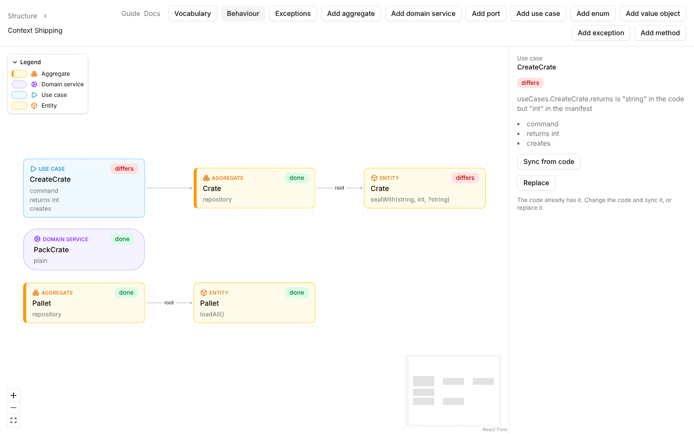

To bring a whole context or resource in step at once, run:

```bash
php artisan kit:import --context=Shipping --sync --dry-run   # print what would change
php artisan kit:import --context=Shipping --sync             # write it
```

- Every piece the code has takes the code's shape.
- What only the manifest lists stays, and is listed under *Kept … but not in the code*: it is designed and not built yet, or it is the old name of something you renamed in the code. Add `--prune` to take those out too.
- A piece in the middle of a replacement is left as the design says.

To rename a built method: rename it in the code (with its callers and its test), then run `kit:import --context=X --sync --prune`, or sync without `--prune` and remove the old name on the screen.

If the manifest changed on disk since the page loaded (another tab, `kit:import`, a `git checkout`), the save is refused with *The manifest changed since this page loaded. Reload it, then make the change again.*

## Replacing what is built

A built port (one with an adapter), use case or domain service changes by replacement: the new one is built beside the old one, the code is pointed at it, and the old one goes once the tests pass. Aggregates, enums and value objects cannot be replaced this way.

1. Select the built card and click its **Replace** icon. Give the new adapter (`Infra/{Folder}/{Prefix}{Port}`), or the new name. A list use case is replaced by another `List…` that names what it lists another way, such as `ListOwnCrates`.

   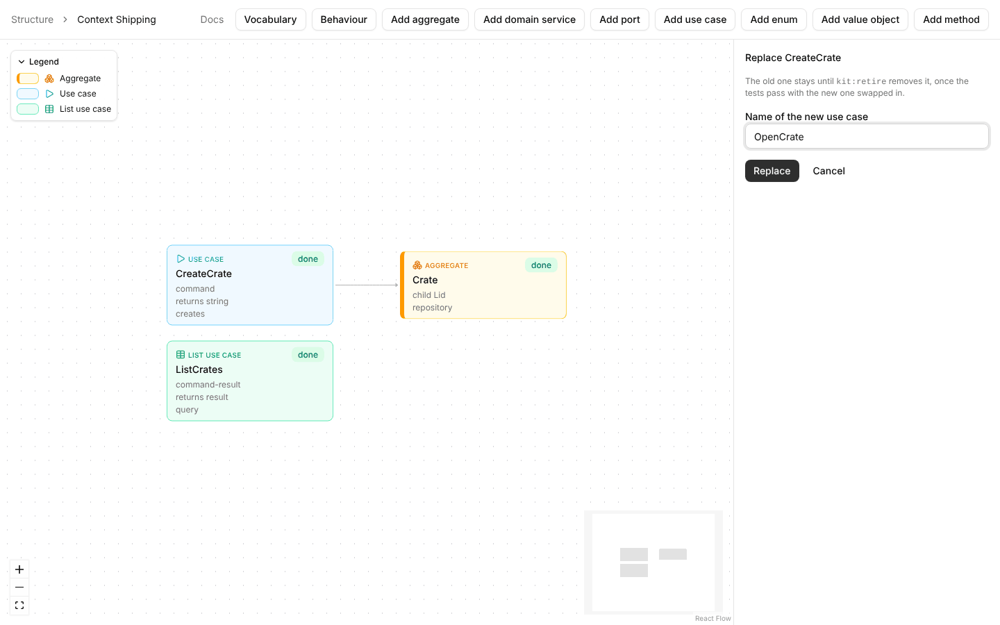

2. The new card reads `replaces …` and **ready**. For a use case, every HTTP resource that called the old one now calls the new one. Edit the new piece as usual. **Cancel replacement** undoes it while the new piece is not built.

   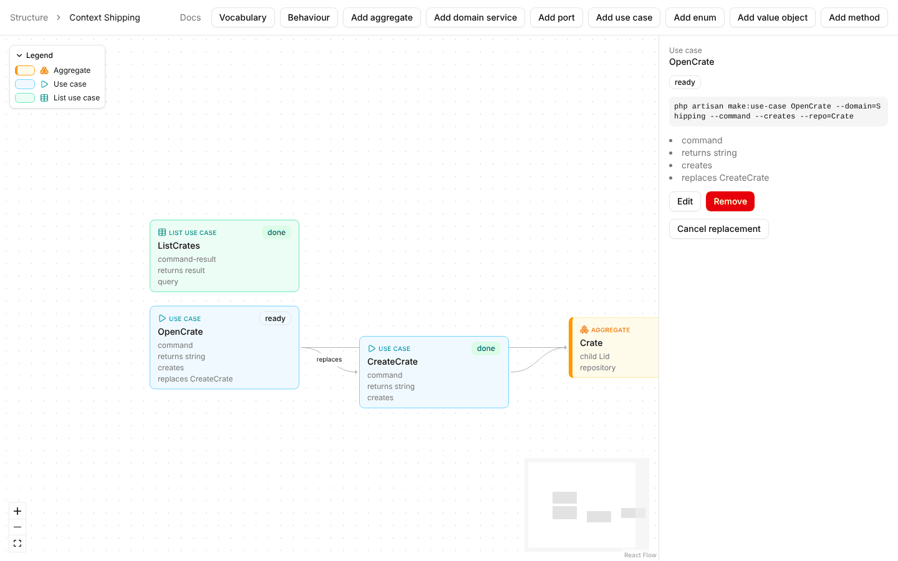

3. `php artisan kit:apply` builds the new piece and swaps it in.
4. `php artisan kit:retire` removes the old piece once nothing else names it and the Architecture, Unit and Feature suites pass. It lists anything that still names the old piece.

The details are in [structure.md, Replacing what is built](../resources/boost/guidelines/structure.md).

## The files behind the screen

| File | Holds |
|---|---|
| `.kit/structure/{Context}.json` | One context: aggregates, services, ports, use cases, enums, value objects, entities. |
| `.kit/structure/Shared.json` | The shared kernel's enums and value objects. |
| `.kit/structure/http/{Resource}.json` | One HTTP resource: model, controller, actions, policy, pages. |

The screen writes them in canonical form (sorted keys, four-space indent), so a diff shows only what changed. Commit them with the code. Git keeps every earlier version, and nothing else does.

The four commands work on the same files:

- `kit:import` writes the manifests from the code, or with `--sync` merges the code into them;
- `kit:plan` lists the steps the screen shows as statuses;
- `kit:apply` builds them;
- `kit:retire` ends a replacement.

The Architecture suite's `structure` check compares the code with the manifests both ways.

## Troubleshooting

| What you see | Why, and what to do |
|---|---|
| `/kit/structure` is a 404 | `APP_ENV` is not `local`, or `KitServiceProvider` is missing from `bootstrap/providers.php`. |
| A blank page, or a Vite manifest error | Vite is not running, or `resources/js/kit/structure.tsx` is not in `vite.config.ts`. Run `npm run dev`. |
| A context or resource is missing from the overview | Its JSON is malformed. The screen leaves out a manifest it cannot read. Run `php artisan test --testsuite=Architecture`: the `structure:files` check names the problem. |
| A card reads **differs** | The code is built another way. If the code is right, click **Sync from code**. Otherwise change the code (or, for something not yet built, the manifest). |
| A name is refused as already in the code | The manifest is behind the code. Run `php artisan kit:import --context=X --sync`, which adds what the code has and keeps the designs not yet built. |
| *The manifest changed since this page loaded* | Reload the page and make the change again. |
| No **Edit** icon | The piece is built. Change the code and sync it, or replace it. |
